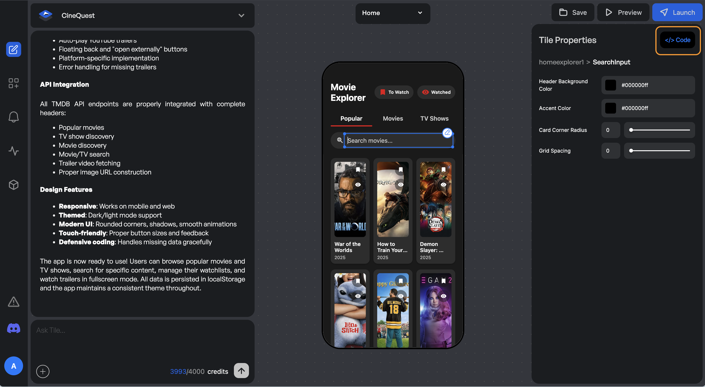

# 🐞 Debugging and Fixing Issues in Tile.dev

Tile.dev helps you build apps faster with AI—but like any creative tool, things can go off track.  
Maybe your app doesn’t behave as expected, or a feature breaks.

This guide walks you through how to fix common problems and get back to building.

---

## ✅ Step 1: Use the **Attempt Fix** Button First

When the agent detects an error, Tile automatically shows the **Attempt Fix** button.

### What It Does:

- Captures the current on-screen error
- Inserts it into the prompt box
- Prepares a clean, debug-ready message for the AI agent

All you need to do is:

1. Click **Attempt Fix**  
2. Review the generated prompt  
3. Hit **Send**

The AI will try to debug and regenerate the broken part of your app.

> ⚠️ If it doesn’t work after 1–2 attempts, move to Step 2.

---

## 🛠 Step 2: Investigate and Edit Code Manually

Use this when:

1. **Attempt Fix doesn’t solve the issue**
2. Your app runs, but something feels off or not quite right

### What to Do:

- Review your prompt for clarity and simplicity  
- Test components individually to isolate the issue  
- Inspect logic: check if screens, buttons, and links work as expected  
- Use screenshots to show and describe the issue to the agent

> 🧠 Pro Tip: Clear visual references help agents troubleshoot faster.

---

## ✏️ How to Edit Code

You can directly edit the code when needed:

- Click the **Edit Code** button in the **Properties Panel**
- Make changes to logic, data bindings, or UI manually
- Save your updates and preview the app again

---

## 💬 Final Tip: Debugging Is Part of Building

Every builder—AI-assisted or not—runs into bugs. What matters is how quickly you recover.

With tools like **Attempt Fix**, direct code editing, and smart prompting, Tile.dev gives you the flexibility to:

- Fix issues fast  
- Learn what went wrong  
- Keep momentum going

Keep building. We’ve got your back.
