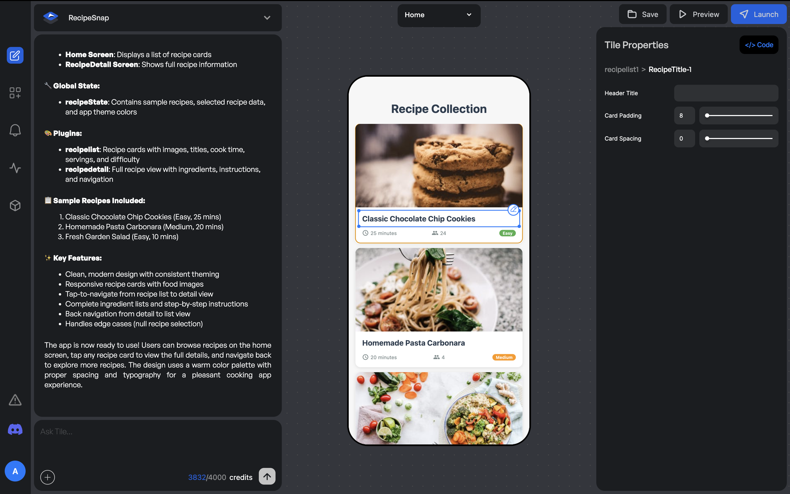

Tile's **Visual Edits** feature lets you interact directly with the app preview. You can hover over and select any Tile or component to make quick updates. These include changes to text, colors, layout, or behavior, all without writing code or using a separate prompt.

## When to Use Visual Edits

Use Visual Edits when you want to:
* Update static text on your app screen
* Change fonts, font sizes, or text styles
* Modify colors of text, buttons, or other UI elements

## How Visual Edits Work in Tile

* Hover over the preview panel to select a Tile or its components
* Once selected, the **Properties Panel** on the right displays the editable properties for that element.
* These properties are automatically exposed by the agent
* If a property you want to change is not visible, you can ask the agent to expose it for you
* You can also point to any element in the preview and ask the agent to expose its properties in the Properties Panel

## Saving and Publishing Your Changes

Once you've edited the properties in the panel, click **Save** to store your changes on the web. However, if your app is already live, you'll also need to click the **Publish** button for the changes to reflect in your live app.

That's how easy it is to customize your app with Tile.

## Editing AI-Generated Image Banners

If your app was generated by the agent and includes image banners, you can use the **Properties Panel** to replace or edit those images.

* Simply select the image banner element in the preview panel
* If the image property is already exposed, you'll be able to upload a new image or update the existing one
* If the image property is not visible, select the image element and ask the agent to **Expose the image in the Properties Panel**

This ensures you can easily customize AI-generated visuals to better match your brand or app experience.